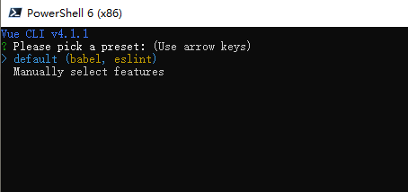
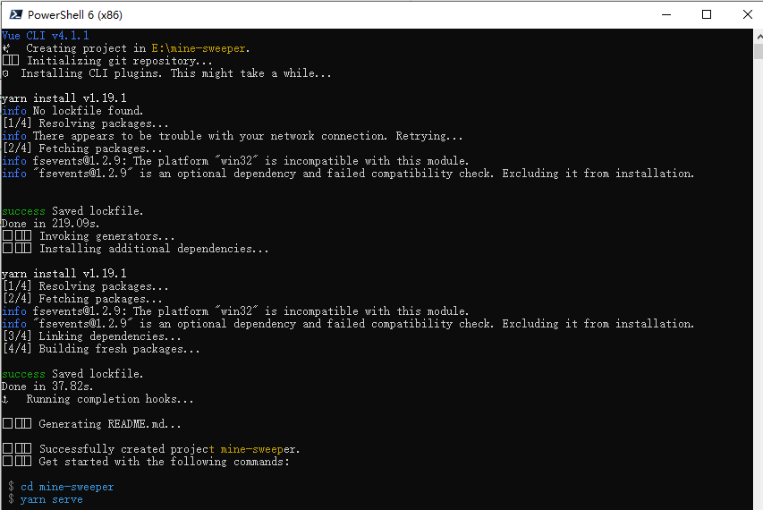
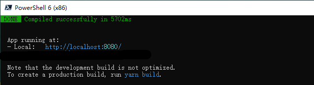
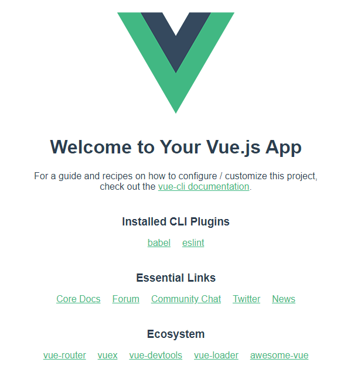

# 创建第一个 Vue 应用

上一节已经搭建好了基础环境，现在就可以开始干了。

## 创建项目

> 创建项目时，不需要特意去创建一个空的目录，vue-cli 会自动创建新目录作为项目目录(与项目名称相同)

执行命令创建项目 `mine-sweeper`

```shell
vue create mine-sweeper
```

创建过程中，会有一些选项，此时需要选择:



此时选择 `default (babel, eslint)`，直接按 **回车** 即可。

此选项表示使用 `babel` 处理 ES6 以及 ES-next 等新功能，同时使用 `eslint` 执行代码检查。

> 注: 使用默认选仅为个人喜好，有兴趣也可以看看手动配置项

选择后会自动使用 `yarn` 开始安装依赖的插件。



当然，也可以选择新的 UI 方式创建 (我还没有使用过)

```shell
vue ui
```

安装好后，执行命令

```shell
cd mine-sweeper
yarn serve
```

便可以启动项目了



此时，到浏览器打开地址 http://localhost:8080/ 便能看到 HelloWord 界面了。



## 目录结构说明

- *.git* git 仓库目录
- *node_modules* node 包存放目录
- *public* 不经过编译的静态文件存放目录
  - *favicon.ico*
  - *index.html* 入口html文件
- *src* 源码目录 (也就是我们的工作目录)
  - *assets* 需要被编译的静态文件存放目录，比如 图片 样式 脚本
  - *components* 组件放到此目录下
  - *App.vue* 入口组件，被 main.js 调用
  - *main.js* 编译入口文件
- *.gitignore*
- *babel.config.js* babel 配置文件
- *package.json* 项目配置文件，提供给npm使用的命令，以及项目依赖存放
- *README.md*
- *yarn.lock*

---
本节完
