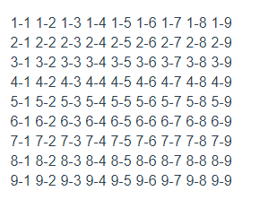
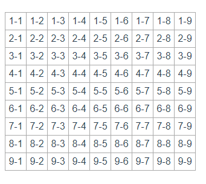

# 编写第一个组件

我们要开始写扫雷游戏了，此时需要删掉自动创建的一些文件，加上我们自己创建的新文件。

在这之前，可以看看 _src/App.vue_ 以及 _src/components/HelloWord.vue_ ，结合前一节说到的组件结构和用法，加深一些了解。

好了，开始吧，先使用 vs code 打开项目目录吧。

> 不要忘记通过命令 `npm run serve` 启动服务器

## 一些准备工作

到 _src/components_ 目录创建文件 _Board.vue_

```html
<template>
  <div class="board"></div>
</template>

<script>
  export default {
    name: 'Board'
  }
</script>

<style lang="less" scoped>
  .Board {
    display: flex;
    height: 100%;
    align-items: center;
    justify-content: center;
    position: relative;
  }
</style>
```

> board，表示扫雷游戏的整个区域。

打开文件 _src/App.vue_，长这样的

```html
<template>
  <div id="app">
    
    <HelloWorld msg="Welcome to Your Vue.js App" />
  </div>
</template>

<script>
  import HelloWorld from './components/HelloWorld.vue'

  export default {
    name: 'app',
    components: {
      HelloWorld
    }
  }
</script>

<style>
  #app {
    font-family: 'Avenir', Helvetica, Arial, sans-serif;
    -webkit-font-smoothing: antialiased;
    -moz-osx-font-smoothing: grayscale;
    text-align: center;
    color: #2c3e50;
    margin-top: 60px;
  }
</style>
```

将原来的 `HelloWord.vue` 组件的引用，替换成 `Board.vue` 的引用

```html
<template>
  <div id="app">
    <Board />
  </div>
</template>

<script>
  import Board from './components/Board.vue'

  export default {
    name: 'app',
    components: {
      Board
    }
  }
</script>

<style>
  #app {
    font-family: 'Avenir', Helvetica, Arial, sans-serif;
    -webkit-font-smoothing: antialiased;
    -moz-osx-font-smoothing: grayscale;
    text-align: center;
    color: #2c3e50;
    margin-top: 60px;
  }
</style>
```

后面，我们整个游戏的开发都会在 _Board.vue_ 组件中进行。

## 准备数据结构

首先定义一下数据结构，扫雷的行列数据，最简单就是使用二维数组来存放了，所以？那就创建一个二维数组 `data` 来存放吧。第一维表示雷区的行，第二维表示雷区的列就行了。

然后，一般的扫雷游戏都有个难度等级吧，我们就用 `level` 来表示好了，这是一个数值，值越大表示难度越大，设置个默认难度为 `1`。

默认难度为 1 了，那么再默认一个雷的数量 `mineCount` 吧，就设置为 9 好了

再想想，还需要定义雷区的尺寸，也就是需要几行 `rows` 几列 `cols`，就都设置为 9 吧

于是，得到了下面的组件数据声明:

```javascript
export default {
  data() {
    return {
      // 使用 data 作为扫雷的数据存储
      data: [],
      level: 1,
      mineCount: 9,
      rows: 9,
      cols: 9
  }
}
```

## 构建布局/样式

既然是扫雷游戏，那么总得有个区域吧，看起来每个雷区都是一个格子，这样的布局，不正是表格擅长的吗？

_Board.vue_ 模板如下

```html
<template>
  <div class="board">
    <table>
      <tr v-for="i in rows" :key="i">
        <td v-for="j in cols" :key="j">
          {{i}}-{{j}}
        </td>
      </tr>
    </table>
  </div>
</template>
```

在此，使用 `{{i}}-{{j}}` 将行和列的值都给显示在了界面上。

> 不晓得你有没有注意到，`rows`和`cols`是个数值，在使用 `i in rows`这样的写法时，得到的 `i` 是从 `1` 开始的，其结果也包含了 `rows` 的最大值 `9`

保存后，界面会自动更新，显示如图



此时会发现，生成的表格没有边框，很难分清单元格的边界在哪里。所以，写点样式吧

```html
<style scoped>
  table {
    border: 1px solid #aaaaaa;
    border-collapse: collapse;
  }
  td {
    border: 1px solid #aaaaaa;
    padding: 5px;
  }
</style>
```

显示效果如下




