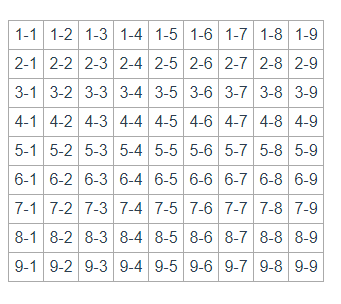
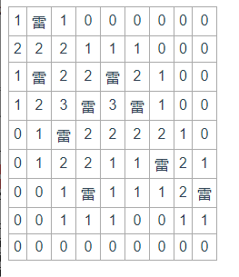

# 编写第一个组件 面板

我们要开始写扫雷游戏了，此时需要删掉自动创建的一些文件，加上我们自己创建的新文件。

在这之前，可以看看 _src/App.vue_ 以及 _src/components/HelloWord.vue_ ，结合前一节说到的组件结构和用法，加深一些了解。

好了，开始吧，先使用 vs code 打开项目目录吧。

> 不要忘记通过命令 `npm run serve` 启动服务器

## 一些准备工作

到 _src/components_ 目录创建文件 _Board.vue_，并填上以下代码

```html
<template>
  <div class="board"></div>
</template>

<script>
  export default {
    name: 'Board'
  }
</script>
```

此时，创建了一个名叫 `Board` 的单文件 Vue 组件。

> board，表示扫雷游戏的整个区域。

打开文件 _src/App.vue_，长这样的，将原来的 `HelloWord.vue` 组件的引用，替换成 `Board.vue` 的引用

```html
<template>
  <div id="app">
    <board />
  </div>
</template>

<script>
  import Board from './components/Board.vue'

  export default {
    name: 'app',
    components: {
      Board
    }
  }
</script>
```

后面，我们整个游戏的开发都会在 _Board.vue_ 组件中进行。

## 准备数据结构

首先定义一下数据结构，扫雷的行列数据，最简单就是使用二维数组来存放了，所以？那就创建一个二维数组 `data` 来存放吧。第一维表示雷区的行，第二维表示雷区的列就行了。

然后，一般的扫雷游戏都有个难度等级吧，我们就用 `level` 来表示好了，这是一个数值，值越大表示难度越大，设置个默认难度为 `1`。

默认难度为 1 了，那么再默认一个雷的数量 `mineCount` 吧，就设置为 9 好了

再想想，还需要定义雷区的尺寸，也就是需要几行几列 `size` (使行列数相同)，就都设置为 9 吧

于是，得到了下面的组件数据声明:

```javascript
export default {
  data() {
    return {
      // 使用 data 作为扫雷的数据存储
      data: [],
      level: 1,
      mineCount: 9,
      size: 9
  }
}
```

## 构建布局/样式

既然是扫雷游戏，那么总得有个区域吧，看起来每个雷区都是一个格子，这样的布局，不正是表格擅长的吗？

_Board.vue_ 模板如下

```html
<template>
  <div class="board">
    <table>
      <tr v-for="i in size" :key="i">
        <td v-for="j in size" :key="j">
          {{i}}-{{j}}
        </td>
      </tr>
    </table>
  </div>
</template>
```

在此，使用 `{{i}}-{{j}}` 将行和列的值都给显示在了界面上。

> 不晓得你有没有注意到，`size` 是个数值，在使用 `i in size`这样的写法时，得到的 `i` 是从 `1` 开始的，其结果也包含了 `size` 的最大值 `9`

保存后，界面会自动更新，显示如图


此时会发现，生成的表格没有边框，很难分清单元格的边界在哪里。所以，写点样式吧

```html
<style scoped>
  table {
    border: 1px solid #aaaaaa;
    border-collapse: collapse;
  }
  td {
    border: 1px solid #aaaaaa;
    padding: 5px;
  }
</style>
```

显示效果如下



## 生成扫雷数据

生成扫雷数据的详细算法以及过程参见源码 *src/component/Board.vue* 中的方法

生成后的数据，被填充到了 `data` 中，现在，改造一下模板，使其能直接显示这些数据

```html
<template>
  <div class="board">
    <table>
      <tr v-for="(row, rowIndex) in data" :key="rowIndex">
        <td v-for="cell in row" :key="cell.col">
          <span v-if="cell.mine">雷</span>
          <span v-else>{{cell.count}}</span>
        </td>
      </tr>
    </table>
  </div>
</template>
```

显示效果如下



---
本节完
