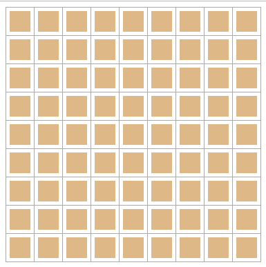
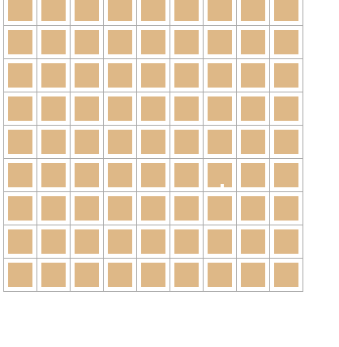
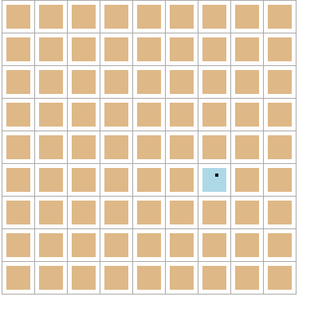

# 编写第二个组件 雷区

上一节已经画出了雷区，并且按位置放置好了雷，那么这一节，就要开始交互处理了。

但是，细细一想，在扫雷游戏中，每个雷区都会有遮罩(mask)、雷、旗、问号等显示，并且需要处理鼠标的左/右键的点击事件，相对来说，这算一个比较复杂的功能了。既然如此，就新写一个组件 `Square.vue` 吧。

## Square.vue

_Square.vue_

```html
<template>
  <div class="square" :class="computedClass" @click="onClick">
    <span class="text" v-if="clipped && square.mine">雷</span>
    <span class="text" v-if="clipped && !square.mine">{{square.count}}</span>
  </div>
</template>

<script>
export default {
  name: "Square",
  props: {
    data: {
      type: Object,
      required: true
    }
  },
  data() {
    return {
      // 标记此区是否已经被翻开
      clipped: false
    };
  },
  computed: {
    // 自动计算样式
    computedClass() {
      return {
        clipped: this.clipped
      };
    },
    square() {
      return this.data || {};
    }
  },
  methods: {
    onClick() {
      this.clipped = true;
    }
  }
};
</script>
<style lang="less" scoped>
.square {
  display: block;
  height: 30px;
  line-height: 30px;
  width: 30px;
  text-align: center;
  background-color: burlywood;
  /* 设置鼠标动作交互 */
  &:hover {
    background-color: lightblue;
  }
}

.clipped,
.clipped:hover {
  background-color: #ffffff;
}
</style>
```

> 此时，我使用了 `Less` 样式，需要先安装 `Less` 支持 `yarn add less less-loader -D`，对应的 npm 命令为 `npm install less less-loader --save-dev`

效果如下



现在来说明一下此组件中用到的东西:

- 设置了一个名为 `data` 的属性(prop)，以接收从父组件 `Board`传过来的雷区数据。
- 设置数据 `clipped` 用来标记雷区是否已经翻开
- 计算属性 `computedClass` 用于在 `clipped` 变化时，自动切换样式类 `clipped`
- 计算属性 `square` 用于获取属性数据 `data`，并在其为空时使用一个空对象代替
- 方法 `onClick` 接收此组件被点击的事件
- `:class="computedClass" @click="onClick"` 分别设置样式 `clipped` 和绑定事件 `onClick`
- 使用了 `v-if` 语法，在不同的条件下显示不同的内容
- `{{square.count}}` 输出文本到界面上

在 _Board.vue_ 中引用:

```html
<template>
  <div class="board">
    <table>
      <tr v-for="(row, rowIndex) in data" :key="rowIndex">
        <td v-for="cell in row" :key="cell.col">
          <square :data="cell" />
        </td>
      </tr>
    </table>
  </div>
</template>

<script>
import Square from './Square'
export default {
  // 此处省略了之前已经写好的代码
  components: { Square }
}
</script>
```

到现在，就有了简单的鼠标交互了，此时点击雷区就能翻开指定块了。



## 插旗标记

回想一下扫雷这个游戏，还需要通过鼠标右键来将某个区标记为雷（插旗），所以我们需要再给组件加上鼠标的右键事件，此时，就可以对组件进行一些改造使其能同时响应鼠标的左右键事件，模板如下:

_Square.vue_

```html
<template>
  <div
    class="square"
    :class="computedClass"
    @click.left="onLeftClick"
    @click.right.prevent="onRightClick"
  >
    <span class="text" v-if="clipped && square.mine">雷</span>
    <span class="text" v-if="clipped && !square.mine">{{countText}}</span>
  </div>
</template>

<script>
// 省略了已经写好的部分
export default {
  data() {
    return {
      // 标记是否已经插上了旗
      flagged: false
    };
  },
  computed: {
    countText() {
      return this.data.count ? this.data.count : "";
    }
  },
  methods: {
    onLeftClick() {
      if (this.clipped || this.flagged) {
        return;
      }
      this.clipped = true;
    },
    onRightClick() {
      this.flagged = !this.flagged;
    }
  }
};
</script>
<style lang="less" scoped>
.flagged {
  &:after {
    content: "旗";
    background-color: red;
    color: white;
    padding: 1px 3px;
    font-size: 12px;
  }
}
</style>
```

效果如图



继续解释一下新增加的部分:

- `@click.left` 和 `@click.right.prevent` 分别绑定鼠标的左/右键点击事件，`left`、`right` 以及 `prevent` 都是 Vue 提供了事件修饰符， 其中的 `prevent` 即`e.preventDefault()`
- `flagged` 新添加的数据，用于标记雷区是否使用旗标记
- `countText` 这个计算属性，用于在周围的雷数量为 `0` 时，在界面上显示为空白

到此，扫雷的基本功能就完成了。

---
本节完
