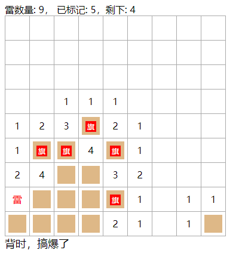
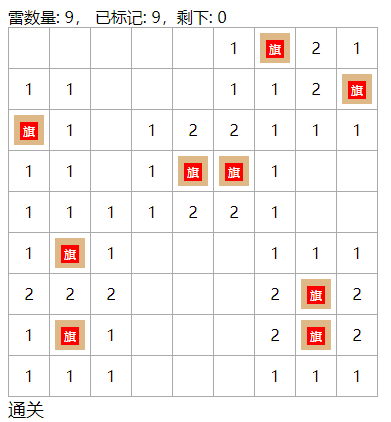

# 游戏统计以及结果

前一节完成了扫雷的基本功能：翻开雷区以及标记为雷。在这一节，就到获取游戏结果的时候了。

有个问题，我们之前的翻开雷区以及标记为雷都是在 `Square` 组件中实现的，但是游戏结果需要 `Board` 组件来统计，咋整呢？ 这时候就需要用到事件传递了。

## 组件的事件传递

在 Vue 中，父子组件中经常会传递事件；在此，也仅仅会涉及到父组件接收子组件传递的事件。

> 若欲了解更多事件相关信息，请查阅文档的事件以及事件总线

子组件通过 `this.$emit('event-name', payload, ...)` 向父组件发事件，父组件通过在调用子组件时的 `@event-name="eventHandler"` 来接收并处理事件。

其中，`event-name` 是事件的名称，`payload` 是事件的负载（可以是任何类型的数据）， `$emit` 方法在事件名后，可以传递多个参数，此时，在 `eventHandler` 函数上会接收到相同数量的参数。

所以，对 `Square` 组件进行一些改动，以将翻开与标雷事件传递给 `Board` 组件:

## 发出事件

_Square.vue_

```javascript
export default {methods: {
    onLeftClick() {
      if (this.clipped || this.marked) {
        return;
      }
      this.clipped = true;
      if (this.data.mine) {
          // 当前是雷时，触发爆炸事件
        this.$emit("exploded");
      } else {
          // 当前不是雷时触发翻开事件
        this.$emit("clipped");
      }
    },
    onRightClick() {
        // 切换插旗
      this.marked = !this.marked;
      this.$emit("marked", this.marked);
    }
  }
}
```

此时，一共触发了三个事件:

- `exploded` 当翻开雷区时遇到雷触发
- `clipped` 当翻开雷区时未遇到雷触发
- `marked` 当插上旗后触发

## 接收事件

_Board.vue_

```html
<template>
  <div class="board">
    <div>雷数量: {{mineCount}}， 已标记: {{markCount}}，剩下: {{mineCount - markCount}}</div>
    <table>
      <tr v-for="(row, rowIndex) in data" :key="rowIndex">
        <td v-for="cell in row" :key="cell.col">
          <square :data="cell" @clipped="onClipped" @exploded="onExploded" @marked="onMarked" />
        </td>
      </tr>
    </table>
    <div class="result" v-if="result">{{result}}</div>
  </div>
</template>

<script>
// 省略已经写好的部分
export default {
  data() {
    return {
      // 标雷数量
      markCount: 0,
      // 翻开数量
      clipCount: 0,
      // 游戏结果
      result: null
    };
  },
  watch: {
    remainSquares(v) {
      if (v === 0) {
        this.result = "通关";
      }
    }
  },
  computed: {
    remainSquares() {
      return this.size ** 2 - this.markCount - this.clipCount;
    }
  },
  methods: {
    onClipped() {
      this.clipCount++;
    },
    onExploded() {
      this.result = "背时，搞爆了";
    },
    onMarked(marked) {
      if (marked) {
        this.markCount++;
      } else {
        this.markCount--;
      }
    }
  }
};
</script>
```

在 `Board` 组件中，接收了三个事件 `@clipped="onClipped" @exploded="onExploded" @marked="onMarked"`。另外添加了一个 `div.result` 用于显示游戏结果。

在游戏面板上方，添加了雷数量统计信息的展示。

新增加了一个计算属性 `remainSquares`，用于计算剩下未翻开并且未插旗的雷区，当此值为0时，表示游戏通关。 `this.size ** 2` 表示雷区总数量。

另外，新增了一个监视器 `remainSquares`，以监视其值的变化，在变化时，判断游戏是否通关。

结果来源：

- 当翻开雷时，会触发 `exploded` 事件，此时会设置 `result` 的值，此时为游戏失败
- 当已经翻开和标记块之和等于总数时，，此时为游戏通过





---
全完

## 总结

回顾这个小游戏的开发，已经介绍了以下内容:

- 使用 Vue cli 创建项目
- Vue 组件的结构
- Vue 模板以及语法
- Vue 事件传递
- Vue 计算属性
- Vue 监视器

而 Vue 远不只是如此，还有很多有意思的东西，等你去玩。当然，这个小游戏也不只如此，它还有一个更加完整的版本，存放在https://gitee.com/hyjiacan/mine-sweeper 的 **full** 分支上，有兴趣的朋友可以移步查看源码。

祝各位朋友在前端的坑里，越滑越深！！
